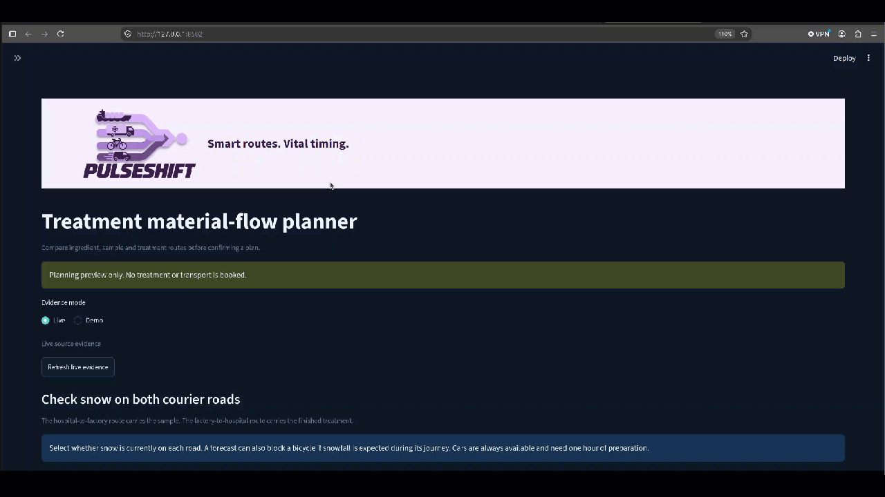

# Treatment material-flow planner

> Built at [HackAmRhein 2026](https://hackamrhein.dev) with Codex. First time in this repository? The setup guide is [HACKAMRHEIN.md](HACKAMRHEIN.md).

A manufacturing-control prototype for a production coordinator managing one individual treatment. The integrated demo opens with live public evidence, compares alternatives with the planning engine, and requires an explicit plan confirmation. A separate offline demo mode provides three independent, clearly labelled synthetic disruption controls.



## The problem

Environmental disruptions can delay ingredients from Rotterdam or block courier journeys between a Basel hospital and production site. The coordinator needs to compare revised plans before these delays affect the treatment timeline. The demo uses an invented planning workflow and synthetic treatment inputs.

The agreed rules and remaining design questions are in [docs/design.md](docs/design.md).

## How to run it

Use Python 3.12 and run these commands from the repository root. Dependencies stay in the local, ignored virtual environment. requirements.txt pins the resolved dependencies; pyproject.toml declares the project and development tools. No activation is required.

Windows PowerShell:

```powershell
python -m venv .venv
.venv\Scripts\python.exe -m pip install -r requirements.txt
.venv\Scripts\python.exe -m pip install --no-deps --no-build-isolation -e .
.venv\Scripts\python.exe -m streamlit run app.py --server.address 127.0.0.1
```

macOS/Linux:

```sh
python3.12 -m venv .venv
.venv/bin/python -m pip install -r requirements.txt
.venv/bin/python -m pip install --no-deps --no-build-isolation -e .
.venv/bin/python -m streamlit run app.py --server.address 127.0.0.1
```

Open http://localhost:8501. The app opens in **Live** mode and loads public weather and Rhine station evidence. Select **Demo** to work offline with the fixed walkthrough. The three controls independently change Rhine conditions, outbound journey conditions, and return journey conditions. Choose a planning goal, inspect the recommended alternative and its route sketches, expand details when needed, then explicitly confirm a plan. Any material input change clears confirmation.

Use **Routes & conditions** to inspect the three routes and their evidence. In Live mode, enter whether each road is cleared. MeteoSwiss snowfall at the PulseShift production site or University Hospital Basel blocks bicycle travel; cars are always available and need one hour of preparation. **Sources & assumptions** explains source attribution, coverage and model limits. **Refresh live evidence** is an explicit action; switching pages does not silently request new data.

The Live overview shows forecast temperature and a weather symbol at the PulseShift production site and University Hospital Basel, plus the Basel gauge on a 0–10 m scale. For the ship route, the planner assumes the Basel level applies along the whole Rhine route and uses the existing illustrative low-water rule to add zero or 12 hours. This is a model output, not a measured delivery time. A forecast at or above 28°C asks the coordinator to recheck the weather on the trip day; it does not block a bicycle. The optional **Basel station chart** remains supporting evidence.

### Checks

Windows:

```powershell
.venv\Scripts\python.exe -m ruff format --check app.py src tests
.venv\Scripts\python.exe -m ruff check app.py src tests
.venv\Scripts\python.exe -m pytest -q
```

On macOS/Linux, use `.venv/bin/python` instead. Contract, adapter, planning and end-to-end screen tests cover shared models, deadlines, changed-input selection and offline evidence. To update dependencies, install through the project manifest and regenerate requirements.txt with `python -m pip freeze --exclude-editable` inside the project environment; never include editable-install paths or private local configuration.

## Data sources

See [docs/SOURCES.md](docs/SOURCES.md).

## Limits

Treatment timings, transport durations and disruption effects are model assumptions. Public data covers stations and forecast periods, not the full shipping route or every transport route. Live mode does not fall back to synthetic or replay data. The finite alternative set is not exhaustive optimisation. The prototype does not make clinical decisions, book transport or process patient records. More detail is in [docs/SOURCES.md](docs/SOURCES.md).

## Team

@philLeu, @Fhuelin, @luapreta-cloud, @janaaaaaaaa. See [TEAM.md](TEAM.md) for ownership and working rules, and [docs/plan.md](docs/plan.md) for the proposed task split.
